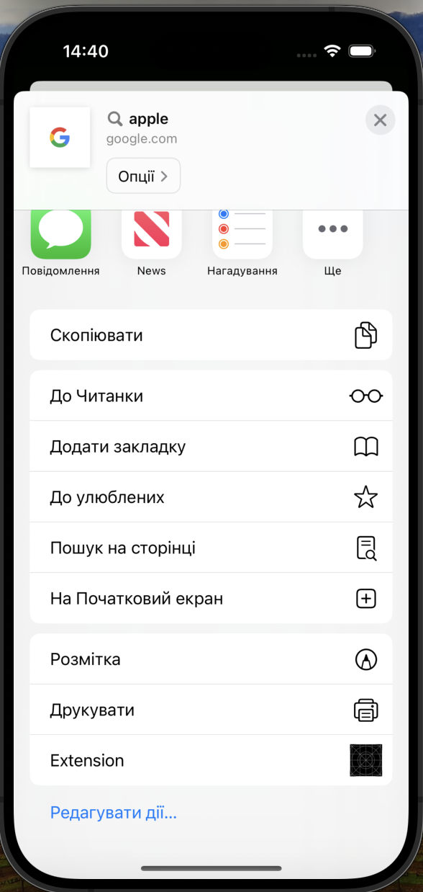
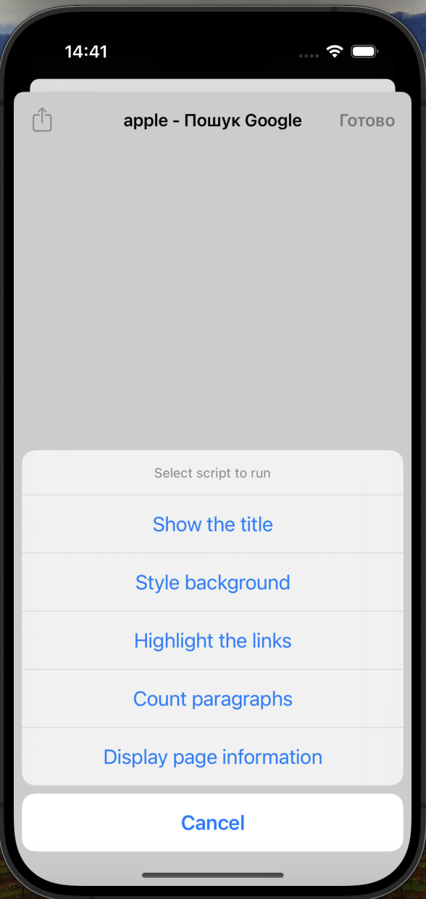
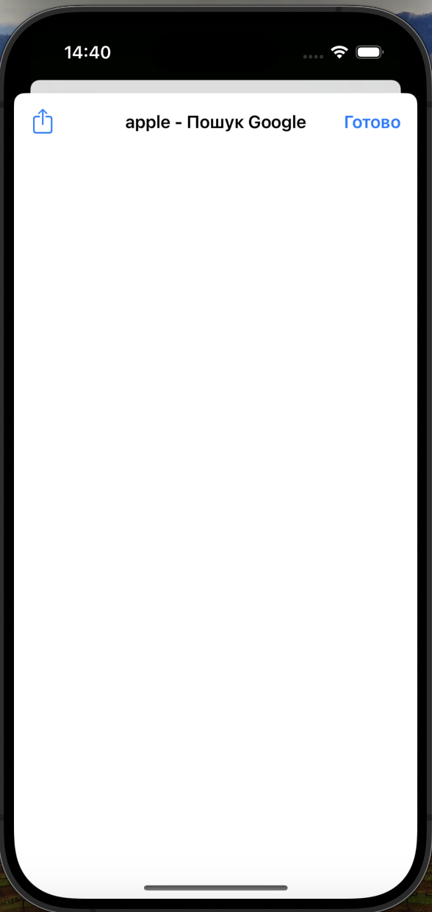
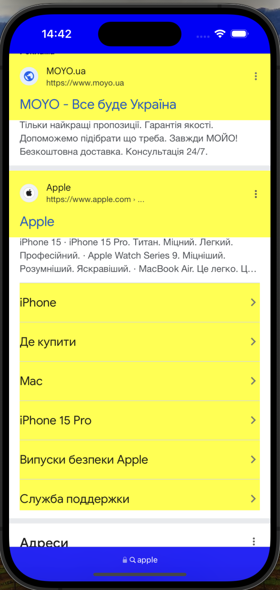

# Project: Browser Extension with JavaScript Scripts

This is an iOS app extension that allows users to run custom JavaScript scripts on web pages. Users can create, view, and manage their scripts and apply them directly from the app extension.

## Features

* Create and save custom JavaScript scripts
* View and manage a list of saved scripts
* Apply scripts to web pages directly from the app extension
* Custom scripts for various page interactions (e.g., changing background color, counting elements)

## Screenshots

  
   
  <em>Extension Screen</em>

  
   
  <em>Script List Screen</em>

  
   
  <em>Add Script Screen</em>

  
   
  <em>Action Extension Screen</em>

## Functionality

* **Script List:** View a list of saved scripts, select scripts to view details, or delete scripts
* **Add Script:** Create and save new JavaScript scripts
* **Apply Script:** Apply a selected script to the current web page
* **View Script:** View detailed information and the code of a selected script

## Controls

* **Add Script:** Tap the add button to create a new script
* **View Script:** Tap on a script in the list to view its details
* **Apply Script:** Use the action button in the extension to apply a script to the current page
* **Delete Script:** Swipe left on a script in the list to delete it

## Technical Requirements

* iOS 12.0+
* Xcode 12.0+
* Swift 5.0+

## Possible Development

* Add more predefined scripts for common tasks
* Implement user authentication and script syncing across devices
* Enhance the script editor with syntax highlighting and auto-completion
* Add support for script categories and tagging
* Allow sharing scripts with other users
